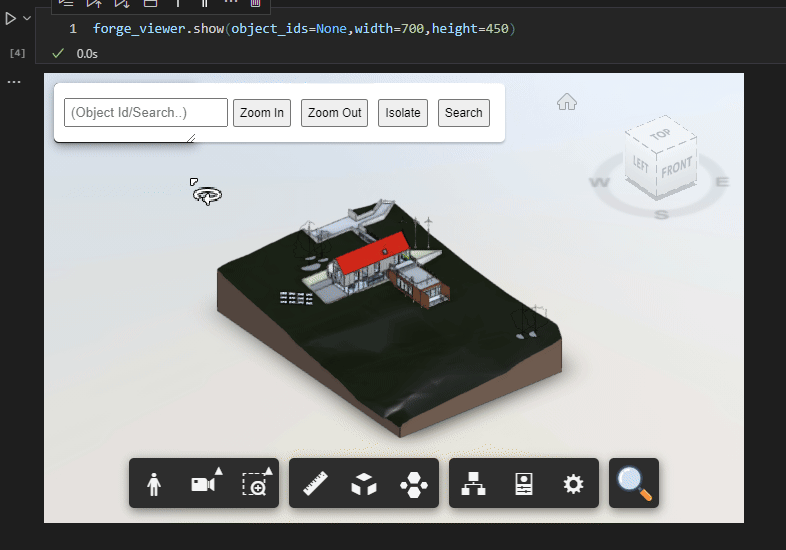

<a href="https://twitter.com/intent/follow?screen_name=chuongmep">
</a>

# 🍫Description

Jupyter Forge is a powerful library that seamlessly integrates Autodesk Platform Services with Jupyter Notebooks, enabling interactive 3D viewing and exploration within your notebook environment.


# ⚡Features

- [x] Show 3d viewer from Autodesk Platform Services
- [x] Show 3d viewer from Autodesk Platform Services with object id
- [x] Show 3d viewer from Autodesk Platform Services with object id and ajust width and height
- [x] Zoom In, Zoom Out, Pan, Isolate,
- [x] Clustering Viewer


- [x] Search Object by Name




## 🦞Installation

```bash
pip install jupyter-forge --upgrade
```

## 🙋🏻‍♂️Requirements

- Python 3.9+

- Setting Environment Variables, see
  Tutorial [Create an App](https://aps.autodesk.com/en/docs/oauth/v2/tutorials/create-app/)

Set Environment Variables

```bash
APS_CLIENT_ID=your_client_id
APS_CLIENT_SECRET=your_client_secret
```

## 🍽️Usage

```python
from jupyter_forge import JupyterForge
from aps_toolkit import Auth

urn = "dXJuOmFkc2sud2lwcHJvZDpmcy5maWxlOnZmLlFsa1ZtVU5RUmYtanMtd3dLQ2dLM1E_dmVyc2lvbj0x"
token = Auth().auth2leg()
forge_viewer = JupyterForge(urn, token)
# object id from derivative api
object_ids = [123, 456]
# show 3d viewer
forge_viewer.show(object_ids, width=800, height=600)
```

## ©️License

This project is licensed under the Apache License - see the [LICENSE](./License.md) file for details.

## 💥Contributing

This is project just research in my free time and don't have any power to keep it up to date. If you want to contribute,
please feel free to fork and submit a pull request.

## 🎁 Sponsors


Thanks [JetBrains](https://www.jetbrains.com/) for providing a free All product IDE for this project.

## Developers

#### Test Data Readme

```python
pip
install - e.
```

#### Fix server not starting

```bash
# start a server with dir 
python -m http.server 54364 --directory D:\API\Forge\jupyter-forge\src\template
``` 

#### Kill Port

```bash
netstat -ano | findstr :54364
taskkill /F /PID 21008
```

- Kill all port relate to 54364

```bash
taskkill /F /PID 21008
```

#### Start Debug

http://localhost:54364/render.html
